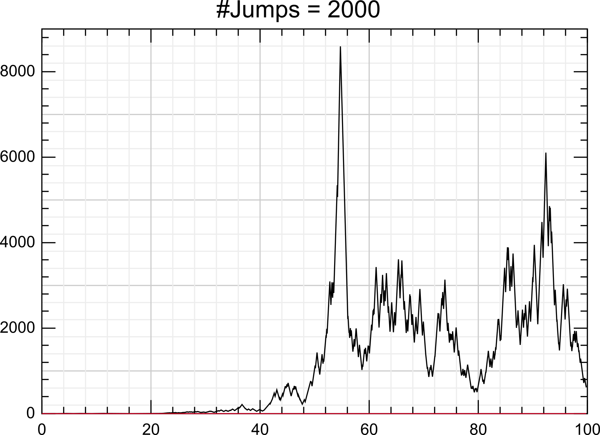

# PDMP.jl 

[](https://travis-ci.org/sdwfrost/PDMP.jl)
[](https://coveralls.io/github/sdwfrost/PDMP.jl?branch=master)
[](https://ci.appveyor.com/project/sdwfrost/pdmp-jl/branch/master)

This is a joint work of [Romain Veltz](https://romainveltz.pythonanywhere.com/) ([@rveltz](http://github.com/rveltz)) and [Simon Frost](http://www.vet.cam.ac.uk/directory/sdf22@cam.ac.uk) ([@sdwfrost](http://github.com/sdwfrost)).

PDMP.jl is a Julia package that allows simulation of *Piecewise Deterministic Markov Processes* (PDMP); these encompass hybrid systems and jump processes, comprised of continuous and discrete components, as well as processes with time-varying rates. The aim of the package is to provide methods for the simulation of these processes that are "exact" up to the ODE integrator.

We provide several methods for the simulation:

- a recent trick, called **CHV**, explained in [paper-2015](http://arxiv.org/abs/1504.06873) which allows to implement the **True Jump Method** without the need to use event detection schemes for the ODE integrator. These event detections can be quite unstable as explained in [paper-2015](http://arxiv.org/abs/1504.06873) and CHV provide a solution to this problem.
- **rejection methods** for which the user is asked to provide a bound on the reaction rates. These last methods are the most "exact" but not the fastest if the reaction rate bound is not tight. In case the flow is known analytically, a method is also provided.


These methods require solving stiff ODEs (for CHV ) in an efficient manner. [```Sundials.jl```](https://github.com/JuliaLang/Sundials.jl) and [```LSODA.jl```](https://github.com/rveltz/LSODA.jl) are used, but other solvers could be easily added. (See [stiff ode solvers](http://lh3lh3.users.sourceforge.net/solveode.shtml)).

We briefly recall facts about a simple class of PDMPs. They are described by a couple 

 where 

 is solution of the differential equation 

. The second component 

 is a jump process with rates 

. At each jump of 

, a jump can also be added to the continuous variable 

.

<!--We briefly recall facts about a simple class of PDMPs. They are decribed by a couple &bc=White&fc=Black&im=svg&fs=11&ff=arev&edit=) where  is solution of the differential equation &bc=White&fc=Black&im=svg&fs=11&ff=arev&edit=). The second component  is a jump process with rates &bc=White&fc=Black&im=svg&fs=11&ff=arev&edit=). At each jump of , a jump can be added to the continuous variable  too..-->

##Installation
To install this (unregistered) package, run the command 	```Pkg.clone("https://github.com/sdwfrost/PDMP.jl.git")```

##Examples
See the [examples directory](https://github.com/sdwfrost/PDMP.jl/tree/master/examples).

A simple example of a TCP process is given below:

```julia
using PDMP

function F_tcp(xc, xd, t, parms)
  # vector field used for the continuous variable
  if mod(xd[1],2)==0
    return vec([xc[1]])
  else
    return vec([-xc[1]])
  end
end

function R_tcp(xc, xd, t, parms, sum_rate::Bool)
  # rate function for each transition
  # in this case,  the transitions are xd1->xd1+1 or xd2->xd2-1
  # sum_rate is a boolean which tells R_tcp the type which must be returned:
  # i.e. the sum of the rates or the vector of the rates
  if sum_rate==false
    return vec([5.0/(1.0 + exp(-xc[1]/1.0 + 5.0)) + 0.1, parms[1]])
  else
    return 5.0/(1.0 + exp(-xc[1]/1.0 + 5.0)) + 0.1 + parms[1]
  end
end

# initial conditions for the continuous/discrete variables
xc0 = vec([0.05])
xd0 = vec([0, 1])

# matrix of jumps for the discrete variables, analogous to chemical reactions
const nu_tcp = [[1 0];[0 -1]]

# parameters  
parms = [0.]
tf = 2000.

dummy =  PDMP.pdmp(2,xc0,xd0,F_tcp,R_tcp,nu_tcp,parms,0.0,tf,false)
result =  @time PDMP.pdmp(2000,xc0,xd0,F_tcp,R_tcp,nu_tcp,parms,0.0,tf,false)

# plotting
using Plots
gr()
Plots.plot(result.time, result.xc[1,:],xlims=[0.,100.],title = string("#Jumps = ",length(result.time)))
```


