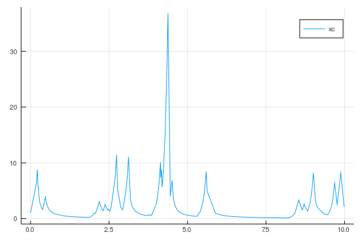

See also the [examples directory](https://github.com/rveltz/PiecewiseDeterministicMarkovProcesses.jl/tree/master/examples) for more involved examples. 

## Basic example with CHV method

A simple example of jump process is shown. We look at the following process of switching dynamics where 

```math
X(t) = (x_c(t), x_d(t)) \in\mathbb R\times\lbrace-1,1\rbrace.
```

In between jumps, $x_c$ evolves according to 

```math
\dot x_c(t) = 10x_c(t),\quad\text{ if } x_d(t)\text{ is even}.
```
```math
\dot x_c(t) = -3x_c(t)^2,\quad \text{ otherwise}.
```

We first need to load the library.  

```julia
using PiecewiseDeterministicMarkovProcesses
const PDMP = PiecewiseDeterministicMarkovProcesses
```
We then define a function that encodes the dynamics in between jumps. We need to provide the vector field of the ODE. Hence, we define a function that, given the continuous state $x_c$ and the discrete state $x_d$ at time $t$, returns the vector field. In addition some parameters can be passed with the variable `parms`.

```julia  
function F!(ẋ, xc, xd, parms, t)
	if mod(xd[1],2)==0
		ẋ[1] = 10xc[1]
	else
		ẋ[1] = -3xc[1]^2
	end
end
```

Let's consider a stochastic process with following transitions:

| Transition | Rate | Reaction number | Jump |
|---|---|---| ---|
|$x_d\to x_d+[1,0]$ | $k(x_c)$ | 1 | [1] |
|$x_d\to x_d+[0,1]$ | $parms$ | 2 | [1] |

We implement these jumps using a 2x1 matrix `nu` of Integers, such that the jumps on each discrete component `xd` are given by `nu * xd`. Hence, we have `nu = [1 0;0 -1]`.	
	
The rates of these reactions are encoded in the following function.


```julia
k(x) = 1 + x

function R!(rate, xc, xd, parms, t, issum::Bool)
	# rate function
	if issum == false
	# in the case, one is required to mutate the vector `rate`
		rate[1] = R(xc[1])
		rate[2] = parms[1]
		return 0.
	else
	# in this case, one is required to return the sum of the rates
		return R(xc[1]) + parms[1]
	end
end

# initial conditions for the continuous/discrete variables
xc0 = [1.0]
xd0 = [0, 0]

# matrix of jumps for the discrete variables, analogous to chemical reactions
nu = [1 0 ; 0 -1]

# parameters
parms = [50.]
```

We define a problem type by giving the characteristics of the process `F, R, Delta, nu`, the initial conditions, and the timespan to solve over:

```
Random.seed!(8) # to get the same result as this simulation!
problem = PDMP.PDMPProblem(F!, R!, nu, xc0, xd0, parms, (0.0, 10.0))
```

After defining the problem, you solve it using `solve`.

```julia
sol =  PDMP.solve(problem, CHV(CVODE_BDF()))
```

In this case, we chose to sample `pb` with the [CHV algorithm](https://arxiv.org/abs/1504.06873) where the flow in between jumps is integrated with the solver `CVODE_BDF()` from [DifferentialEquations.jl](https://github.com/JuliaDiffEq/DifferentialEquations.jl).

We can then plot the solution as follows:

```
# plotting
using Plots
Plots.plot(sol.time,sol.xc[1,:],label="xc")
```

This produces the graph:



 
## Basic example with the rejection method
The previous method is useful when the total rate function varies a lot. In the case where the total rate is mostly constant in between jumps, the **rejection method** is more appropriate. 

The **rejection method** assumes some a priori knowledge of the process one wants to simulate. In particular, the user must be able to provide a bound on the total rate. More precisely, the user must provide a constant bound in between the jumps. To use this method, `R_tcp!` must return `sum(rate), bound_rejection`. Note that this means that in between jumps, one has:


`sum(rate)(t) <= bound_rejection `

```julia
function R2!(rate, xc, xd, parms, t, issum::Bool)
	# rate function
	bound_rejection = 1. + parms[1] + 15  # bound on the total rate
	if issum == false
	# in the case, one is required to mutate the vector `rate`
		rate[1] = R(xc[1])
		rate[2] = parms[1]
		return 0., bound_rejection
	else
	# in this case, one is required to return the sum of the rates
		return R(xc[1]) + parms[1], bound_rejection
	end
end
```

We can now simulate this process as follows

```julia
Random.seed!(8) # to get the same result as this simulation!
problem = PDMP.PDMPProblem(F!, R2!, nu, xc0, xd0, parms, (0.0, 1.0))
sol =  PDMP.solve(problem, Rejection(CVODE_BDF()))
```

In this case, we chose to sample `pb` with the Rejection algorithm where the flow in between jumps is integrated with the solver `CVODE_BDF()` from [DifferentialEquations.jl](https://github.com/JuliaDiffEq/DifferentialEquations.jl).

We can then plot the solution as follows:

```
# plotting
using Plots
Plots.plot(sol.time,sol.xc[1,:],label="xc")
```

This produces the graph:

